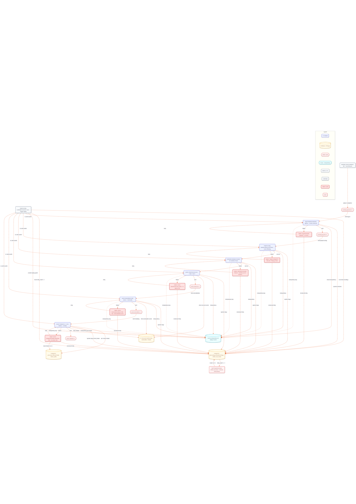

# Research Report: A Resilient Data Engineering Architecture for a Meeting Intelligence Platform

## Table of Contents

1. [Introduction](#1-introduction)
2. [Role of the Data Engineering Layer](#2-role-of-the-data-engineering-layer)
3. [Architectural Principles (Technical Foundation)](#3-architectural-principles-technical-foundation)
4. [Microservices Architecture](#4-microservices-architecture)
5. [High-Level Architecture Overview](#5-high-level-architecture-overview)
6. [Data Engineering Pipeline (Core Section)](#6-data-engineering-pipeline-core-section)
7. [Failure Handling & Retry Strategy](#7-failure-handling--retry-strategy)
8. [Technology Stack & Justification](#8-technology-stack--justification)
9. [Architectural Alternatives & Comparison](#9-architectural-alternatives--comparison)
10. [MVP vs. High-Scale Evolution](#10-mvp-vs-high-scale-evolution)
11. [System Qualities](#11-system-qualities)
12. [Conclusion](#12-conclusion)
13. [Potential Professor Questions](#potential-professor-questions)

---

## 1. Introduction

The proliferation of remote and hybrid work has led to an exponential increase in recorded meetings, creating a vast repository of unstructured audio data. While this data holds immense potential for business intelligence, extracting value from it presents significant technical challenges. Raw audio recordings, often hours long and of varying quality, cannot be directly processed by sophisticated AI models for tasks like transcription, summarization, or action item extraction.

The primary problem lies in bridging the gap between large, unreliable raw media and the structured, sanitized input required by AI systems. This necessitates a robust preparatory layer responsible for ingestion, validation, normalization, and segmentation of the audio data. This report details the architecture of the Data Engineering (DE) layer designed for the Cognita Meeting Intelligence Platform, a system built to be scalable, reliable, and ready for production workloads.

---

## 2. Role of the Data Engineering Layer

The Data Engineering layer is the foundational component of the platform, acting as the critical link between user-facing input services and the downstream AI processing layer. Its responsibilities are strictly defined to ensure a clear separation of concerns.

**Core Responsibilities:**
*   **Ingestion:** Reliably accept raw audio files from various sources.
*   **Standardization:** Convert diverse audio formats and quality levels into a single, canonical format suitable for AI processing.
*   **Segmentation (Chunking):** Break down long recordings into smaller, manageable segments to enable parallel processing and mitigate the impact of failures.
*   **Metadata Management:** Track the state of each processing job, enabling fault tolerance, replayability, and observability.

This separation is critical for managing complexity. The input services focus on user interaction and uploads, the AI layer focuses on model inference, and the DE layer handles the complex, often long-running, and failure-prone task of data preparation. This is particularly crucial for large files and long-running jobs, where the probability of transient failures (network issues, resource contention) is high. The DE layer provides the necessary failure handling and cost control by ensuring that expensive AI computations are only performed on validated, properly formatted data.

---

## 3. Architectural Principles (Technical Foundation)

The architecture is founded on a set of core principles chosen to solve specific challenges inherent in processing large-scale media files.

*   **Batch Processing:** The system is designed primarily for batch processing of entire meeting recordings. This is a natural fit for post-meeting analysis and is simpler and more cost-effective to implement for an MVP than a real-time system.
*   **Event-Driven Architecture:** The system is composed of decoupled services (workers) that communicate through an event bus (Kafka). This was chosen to eliminate direct dependencies between components. When a worker completes its task, it emits an event, which triggers the next worker in the pipeline. This allows for independent scaling, deployment, and maintenance of each component.
*   **Asynchronous Processing:** All data processing tasks are asynchronous. Once a meeting is uploaded, the user receives an immediate acknowledgment, while the long-running processing happens in the background. This solves the problem of blocking user interactions and provides a responsive user experience.
*   **Idempotency:** Every worker is designed to be idempotent, meaning that processing the same input multiple times produces the same result without side effects. This is a critical principle for building a reliable system, as it allows events to be safely replayed in case of failure without causing data corruption or duplicate processing. This is achieved through a combination of database constraints and distributed locks (Redis).
*   **Fault Tolerance:** The system is designed to be resilient to failures. If a worker crashes, it does not bring down the entire pipeline. The event-driven nature, combined with state tracking in a persistent database, allows the system to automatically retry failed operations or resume processing from the last successful checkpoint.
*   **Eventual Consistency:** The state of the system is distributed across multiple components (S3, PostgreSQL, Kafka). While the state of a single component is strongly consistent, the overall system state is eventually consistent. For example, a processed audio chunk might be written to S3 moments before its corresponding metadata is committed to the database. This trade-off is acceptable for this use case, as it allows for higher throughput and availability.

---

## 4. Microservices Architecture

The Data Engineering Layer is architected as a **microservices-based system**, where each worker operates as an independent, stateless service. This design choice aligns with modern distributed systems principles and provides several key benefits for scalability, maintainability, and resilience.

### Service Decomposition

Each processing stage (Ingest, Preprocessing, Validation, Audio Extractor, Audio Normalizer, Audio Chunker) is implemented as a separate microservice with:

- **Independent Deployment:** Services can be deployed, scaled, and updated independently without affecting others
- **Technology Flexibility:** Different services can use different programming languages or frameworks based on their specific needs
- **Fault Isolation:** Failure in one service doesn't cascade to others, improving overall system reliability
- **Team Autonomy:** Enables different development teams to own and maintain individual services

### Service Boundaries

Each microservice has clearly defined responsibilities and interfaces:

- **Dedicated Containers:** Each worker runs in its own Docker container with isolated dependencies
- **Event-Driven Communication:** Services communicate exclusively through Kafka events, eliminating direct service-to-service calls
- **Shared Data Access:** All services access shared PostgreSQL and Redis stores but with proper isolation and atomic operations
- **Health Endpoints:** Each service exposes `/health` endpoints for monitoring and load balancing

### Inter-Service Communication Patterns

**Asynchronous Event-Driven Communication:**
- Workers emit events to Kafka after completing their processing and database commits
- Downstream workers consume these events to trigger their processing
- Enables loose coupling and independent scaling of producers and consumers

**Synchronous Data Access:**
- Services query shared databases for metadata and state information
- Atomic operations (e.g., `SELECT ... FOR UPDATE`) prevent race conditions
- Eventual consistency across the system with strong consistency within individual transactions

### Data Consistency and Transaction Boundaries

**Transactional Integrity:**
- Each worker's processing is wrapped in database transactions
- State updates and event emissions are atomic operations
- Failure at any point triggers rollback and retry mechanisms

**Eventual Consistency Model:**
- The system accepts eventual consistency across components for improved performance
- Source of truth for state (PostgreSQL) remains strongly consistent within transactions
- Acceptable trade-off for high-throughput, distributed processing

### Deployment and Scaling Strategy

**Container Orchestration:**
- Docker containers ensure consistent runtime environments
- Kubernetes or Docker Compose for orchestration in different environments
- Horizontal scaling based on Kafka queue depth and resource utilization

**Scaling Patterns:**
- Independent scaling of each worker type based on load patterns
- CPU-intensive workers (Audio Extractor) may require different scaling than I/O-bound workers
- Spot instances or auto-scaling groups for cost optimization

### Monitoring and Observability

**Service-Level Metrics:**
- Request/response rates and latency percentiles per service
- Error rates and throughput measurements
- Resource utilization (CPU, memory, disk) tracking

**Distributed Tracing:**
- Correlation IDs across service boundaries
- End-to-end tracing of processing pipelines
- Performance bottleneck identification

### Security Considerations

**Service Authentication:**
- Mutual TLS (mTLS) for service-to-service communication
- API keys for external service integrations
- Zero-trust security model

**Network Security:**
- Service mesh encryption
- Network policies restricting communication paths
- Secure access to shared databases and object storage

### Migration Path

**From MVP to Production Microservices:**
1. **Phase 1 (Current):** Services as separate containers but shared codebase
2. **Phase 2:** Independent repositories and CI/CD pipelines per service
3. **Phase 3:** Autonomous teams and independent release cycles

This microservices architecture provides the foundation for the Data Engineering Layer to evolve independently while maintaining compatibility with the broader AI-powered Meeting Intelligence Platform.

---

## 5. High-Level Architecture Overview

The system is logically divided into distinct layers, with data flowing sequentially through them, triggered by events.

1.  **Input Layer:** A user-facing `Meeting Service` handles the initial HTTP upload of an audio file. Upon successful receipt, it places the raw file in object storage (S3/MinIO) and emits a `meeting.uploaded.v1` event onto the event bus.
2.  **Event Bus (Kafka):** Kafka serves as the central nervous system of the architecture. It decouples all producers and consumers, providing a durable and replayable log of events that drive the entire pipeline.
3.  **Data Engineering Pipeline:** This is a series of specialized, single-responsibility workers that consume events from Kafka. Each worker performs a specific transformation on the audio data (e.g., validation, normalization, chunking), stores its output artifact in S3, updates the central metadata store, and emits a new event to signal the completion of its stage.
4.  **AI Transformation Layer:** Downstream from the DE pipeline, a set of AI workers (e.g., Speech-to-Text, Diarization, Summarization) consume the prepared audio chunks. They perform their respective inference tasks and store their results.
5.  **Storage & Metadata:** This layer consists of three key components:
    *   **S3/MinIO:** The source of truth for all binary data (raw, processed, and chunked audio).
    *   **PostgreSQL:** The source of truth for all processing metadata. It tracks the current stage of each meeting, the status of each chunk, retry counts, and errors.
    *   **Redis:** A caching layer used for fast, short-lived locks to enforce idempotency and prevent race conditions during retries.

---

## 5. Data Engineering Pipeline (Core Section)

The core of the DE layer is a microservices-based pipeline where each worker is a small, independent service. Each stage is designed to be idempotent and stateless, with all state managed externally in PostgreSQL and Redis.

*   **Ingest Worker:**
    *   **Purpose:** To serve as the formal entry point into the DE pipeline, validating the initial upload event and establishing the meeting's official record in the metadata store.
    *   **Input and Output:** It consumes a `meeting.uploaded.v1` event containing metadata like `meeting_id` and `s3_path`. Upon success, it creates a record in the `processing_metadata` table and emits a `meeting.ingested.v1` event.
    *   **Rationale:** This initial step is crucial for idempotency. By creating a unique record in the database for each `meeting_id`, it prevents the entire pipeline from running multiple times for the same meeting due to duplicate upload notifications.
    *   **Example:** A user uploads `meeting.mp4`. The Ingest Worker receives the event, verifies the payload is complete, inserts a new row into `processing_metadata` with `current_stage = 'INGESTED'`, and then emits the event to trigger the next stage. If a duplicate event arrives, the database's unique constraint on `meeting_id` will cause the insert to fail, preventing reprocessing.

*   **Preprocessing Worker:**
    *   **Purpose:** To perform lightweight, preliminary audio cleaning operations that improve the quality of the raw audio before more intensive processing.
    *   **Input and Output:** It consumes the `meeting.ingested.v1` event, downloads the raw audio from S3, applies transformations, and uploads the cleaned audio to a new S3 path (e.g., `/processed/{meeting_id}/preprocessed.wav`).
    *   **Rationale:** Raw audio often contains artifacts like DC offset, low-frequency rumble from microphones, or high-frequency hiss. Removing these early, using efficient tools like `ffmpeg` or `sox`, improves the accuracy of all downstream processes, particularly the AI-based transcription.
    *   **Example:** The worker applies a high-pass filter to remove rumble and a low-pass filter to remove hiss. It may also apply a slight volume reduction to prevent clipping in later stages.

*   **Validation Worker:**
    *   **Purpose:** To enforce business rules and technical constraints on the audio, acting as a gatekeeper to prevent costly processing of invalid files.
    *   **Input and Output:** It takes the path to the preprocessed audio. It does not produce a new audio file but rather a validation decision. On success, it updates the meeting's stage in the database; on failure, it marks the meeting as `FAILED`.
    *   **Rationale:** It is economically and technically inefficient to process audio that is guaranteed to fail or produce poor results. This worker uses the `ffprobe` utility to quickly extract metadata (duration, sample rate, channels) and checks it against predefined limits (e.g., duration must be between 30 seconds and 4 hours).
    *   **Example:** An uploaded file is only 10 seconds long. The Validation Worker probes the file, finds its duration is below the minimum threshold, updates the `processing_metadata` record to `status = 'FAILED'` with an error message, and emits a failure event. No further processing occurs.

*   **Audio Extractor:**
    *   **Purpose:** To transcode the wide variety of possible input audio/video formats into a single, canonical audio format required by the downstream AI models.
    *   **Input and Output:** It takes the validated audio file (which could be in formats like MP3, M4A, or part of a video container like MP4) and produces a standardized 16kHz, 16-bit, mono PCM WAV file, stored at `/processed/{meeting_id}/audio.wav`. It then emits an `audio.extracted.v1` event.
    *   **Rationale:** AI models for speech recognition are typically trained on and optimized for a specific audio format. Enforcing this standard format ensures consistent and optimal performance from the AI layer and simplifies the development of all subsequent workers.
    *   **Example:** A user uploads a meeting recorded as an `.mp4` video file. The Audio Extractor uses `ffmpeg` to discard the video stream and transcode the audio stream into the required WAV format.

*   **Audio Normalizer:**
    *   **Purpose:** To standardize the acoustic properties of the audio, specifically loudness and the presence of silence.
    *   **Input and Output:** It takes the canonical WAV file and produces a normalized version at `/processed/{meeting_id}/normalized.wav`, emitting an `audio.normalized.v1` event.
    *   **Rationale:** Speakers in a meeting may talk at very different volumes. Loudness normalization (e.g., using the EBU R128 standard) ensures a consistent volume level, which improves transcription accuracy. Trimming leading and trailing silence reduces the amount of data that needs to be processed without losing any valuable content.
    *   **Example:** The worker uses `sox` or `ffmpeg` to trim any silence longer than a few seconds from the beginning and end of the recording. It then analyzes the audio and adjusts the gain to meet a target loudness level.

*   **Audio Chunker:**
    *   **Purpose:** To segment the full-length, normalized audio into small, overlapping chunks suitable for parallel, fault-tolerant processing by the AI layer.
    *   **Input and Output:** It takes the normalized audio file. It produces dozens or hundreds of small chunk files (e.g., `/processed/{meeting_id}/chunks/chunk_{i}.wav`), creates corresponding records in the `processed_files` table, and emits an `audio.chunked.v1` event for each chunk.
    *   **Rationale:** This is a cornerstone of the architecture's scalability and reliability. Processing a multi-hour file in one go is risky; a single failure would waste all progress. By chunking the audio (e.g., into 15-minute segments with a 20-second overlap), the work can be distributed across many AI workers. If one chunk fails, only that small segment needs to be retried. The overlap ensures that words at the boundary of a chunk are not cut off, preserving context for the AI.
    *   **Example:** For a 60-minute recording, the worker first inserts 5 `PENDING` rows into the `processed_files` table. Then, it iterates: it uses `ffmpeg` to extract the first 15 minutes, uploads it, updates the corresponding database row to `COMPLETED`, updates `processing_metadata.last_chunk_id` to 0, and emits an event for chunk 0. It then proceeds to the next chunk.

*   **Processing Metadata Manager:**
    *   **Purpose:** This is not an active worker but the conceptual entity representing the PostgreSQL database and its role as the single source of truth for pipeline state.
    *   **Rationale:** It provides a durable, transactionally-consistent record of processing progress. Workers use atomic operations like `SELECT ... FOR UPDATE` to "claim" a meeting or chunk before processing, preventing race conditions and ensuring that state transitions are safe and predictable, which is essential for the recovery and replay mechanisms.

*   **Processing Controller (Retry & Replay):**
    *   **Purpose:** To act as an automated supervisor, detecting and recovering from transient failures without manual intervention.
    *   **Input and Output:** It periodically scans the `processing_metadata` and `processed_files` tables. It does not process audio but re-emits events to Kafka to trigger retries for stuck or failed jobs.
    *   **Rationale:** In a distributed system, transient failures are inevitable. This controller automates the recovery process. It finds jobs that have been in a `PROCESSING` state for an unusually long time (indicating a worker crash), increments their retry count, and re-queues them for another attempt.
    *   **Example:** A chunker worker crashes while processing chunk 3 of 5. The `processing_metadata` table shows `last_chunk_id = 2`. After a few minutes, the controller detects the stale `updated_at` timestamp, acquires a replay lock in Redis, increments the `retry_count`, and emits events to process chunks 3, 4, and 5.

---

## 6. Failure Handling & Retry Strategy

The system's resilience is built on a multi-layered strategy for handling failures, centered around automated retries and stateful replay.

*   **Worker Crashes:** If a worker container crashes (e.g., due to an out-of-memory error), the job it was working on remains in a `PROCESSING` state in the database. The `Processing Controller` detects this stale state by querying for jobs where `updated_at` is older than a defined threshold (e.g., 5 minutes). It then triggers a replay of the appropriate event, and a new, healthy instance of the worker picks up the task.

*   **Retry Mechanism:** For transient, retriable errors (e.g., network timeouts to S3 or the database), workers can implement an internal retry loop with exponential backoff. If these internal retries fail, the worker will exit, and the external `Processing Controller` will take over. The `retry_count` in the `processing_metadata` table ensures that a job does not get stuck in an infinite retry loop. After a maximum number of retries (e.g., 3), the job is marked as `FAILED`, and an alert is sent for manual investigation.

*   **Stateful Replay:** The combination of the `processing_metadata` and `processed_files` tables provides the necessary state for intelligent replay. For most stages, a replay involves re-sending the original event. However, for the chunking stage, the replay is more granular. The controller reads the `last_chunk_id` and re-emits processing events only for the chunks that were not successfully completed, saving significant reprocessing time.

*   **Decoupled Pipeline:** Because workers are decoupled by Kafka, a slow or failed event does not block the entire pipeline. Other meetings can be processed concurrently without being affected by a single problematic job. This ensures high throughput and isolates the impact of failures.

*   **Kafka Replay vs. Centralized Orchestration:** This architecture is safer than a traditional orchestrator like Airflow because there is no single point of failure for the orchestration logic. The state is durably stored in PostgreSQL, and the event log is durably stored in Kafka. The `Processing Controller` itself is stateless and can be scaled or restarted without affecting the system's integrity. This decentralized approach to recovery is inherently more resilient.

---

## 7. Technology Stack & Justification

| Technology  | Role                | Justification                                                                                                                                                           | Alternatives Considered |
|-------------|---------------------|-------------------------------------------------------------------------------------------------------------------------------------------------------------------------|-------------------------|
| **Kafka**   | Event Bus           | Chosen for its high throughput, durability, and replayability. It provides excellent decoupling and is the industry standard for event-driven architectures at scale.       | RabbitMQ, Redis Pub/Sub |
| **PostgreSQL**| Metadata Store      | A mature, reliable, and transactionally-consistent relational database. Its support for `SELECT ... FOR UPDATE` provides the atomic locking needed for safe state transitions. | MySQL, MongoDB          |
| **S3 / MinIO**| Object Storage      | A highly scalable, durable, and cost-effective solution for storing large binary files. It is the ideal choice for the audio artifacts produced by the pipeline.         | HDFS, Local Filesystem  |
| **Redis**   | Idempotency Cache   | An in-memory data store providing extremely low-latency operations. It is used for short-lived idempotency keys and distributed locks, offloading this transient state from PostgreSQL. | Memcached               |
| **Docker**  | Containerization    | Ensures a consistent and reproducible environment for each worker, simplifying development, testing, and deployment. It isolates dependencies and standardizes the runtime. | Podman, Virtual Machines|

---

## 8. Architectural Alternatives & Comparison

*   **Kafka vs. Redis Queues:**
    *   **Pros/Cons:** Redis is simpler and faster for basic queueing, but lacks the durability, persistence, and replayability of Kafka's commit log.
    *   **Justification:** For the MVP, Kafka was chosen because fault tolerance and the ability to replay events were core requirements. A simple queue would not provide the same guarantees for recovering from failures.
    *   **At Scale:** This choice becomes even more critical at scale, where Kafka's partitioning allows for massive horizontal scaling of consumers.

*   **Event-Driven vs. Airflow (Orchestration):**
    *   **Pros/Cons:** Airflow provides a centralized view of workflows (DAGs) and handles scheduling and retries. However, it can become a single point of failure, and the orchestrator itself can be a bottleneck. An event-driven approach is more decentralized and resilient.
    *   **Justification:** The event-driven model was chosen for its superior decoupling and resilience. Each worker is independent, which fits the microservices philosophy.
    *   **At Scale:** While Airflow is excellent for complex, dependency-heavy batch jobs, an event-driven architecture is generally better suited for high-throughput, low-latency systems.

*   **Batch vs. Real-time Processing:**
    *   **Pros/Cons:** Real-time processing (e.g., transcribing a live meeting) provides immediate results but is significantly more complex to build, requiring technologies like WebSockets and stream processing frameworks (e.g., Flink, Spark Streaming).
    *   **Justification:** The MVP focuses on post-meeting analysis, for which batch processing is the correct and simplest model.
    *   **At Scale:** The current architecture, with its chunk-based processing, is a stepping stone to real-time. The pipeline could be adapted to process small chunks of audio as they arrive from a live stream, without a fundamental rewrite.

---

## 9. MVP vs. High-Scale Evolution

The current design prioritizes **simplicity, correctness, and reliability** for the MVP. It establishes a solid foundation that can evolve.

**At High Scale, the following would change:**
*   **Autoscaling:** Workers would be deployed on a container orchestration platform like Kubernetes, with Horizontal Pod Autoscalers to scale the number of worker instances up or down based on the number of messages in Kafka topics.
*   **Kafka Partitioning:** Topics would be partitioned by `meeting_id` or `organization_id` to ensure ordered processing where necessary and to allow for higher parallelism.
*   **Database Scaling:** The PostgreSQL database could become a bottleneck. It would evolve by introducing read replicas, connection pooling, and potentially sharding the large `processed_files` table.
*   **Observability:** While the MVP includes basic logging and metrics, a high-scale system would require distributed tracing, more sophisticated alerting, and detailed Grafana dashboards to monitor pipeline latency and throughput.

The core event-driven, chunk-based design remains valid and is precisely what enables this evolution. It is already prepared for the future addition of real-time processing by treating a live audio stream as a sequence of small, sequential chunks.

---

## 10. System Qualities

The architecture was explicitly designed to achieve the following non-functional requirements:

*   **Scalability:** The stateless nature of the workers and the use of Kafka allow for horizontal scaling. To handle more meetings, one simply adds more worker containers.
*   **Reliability:** Achieved through idempotency, automated retries, and the durable nature of the event bus and metadata store. No single worker failure can cause data loss.
*   **Fault Tolerance:** The decentralized design means there is no single point of failure. The Processing Controller ensures that the system can automatically recover from common transient errors.
*   **Consistency:** The system favors availability and throughput by using eventual consistency. The source of truth for state (PostgreSQL) remains strongly consistent within transactions, which is sufficient for this use case.
*   **High Throughput:** The asynchronous, parallel nature of the pipeline, especially after the chunking stage, allows the system to process a large number of meetings concurrently.

---

## 11. Conclusion

The Data Engineering architecture presented in this report is a robust, scalable, and resilient solution for preparing audio data for an AI-powered Meeting Intelligence Platform. By adhering to modern architectural principles such as event-driven design, idempotency, and asynchronous processing, the system is both academically sound and conceptually production-ready.

The design correctly separates concerns, handles failures gracefully, and is built on a technology stack that is proven at scale. It successfully de-risks the most complex part of the meeting intelligence pipeline—the data preparation—thereby enabling the AI layer to operate on a foundation of clean, reliable, and consistently formatted data.

---

## Potential Professor Questions

1.  **Question:** You chose Kafka over a simpler message queue like RabbitMQ. Isn't that over-engineering for an MVP?
    *   **Answer:** While Kafka has a higher operational complexity, its core feature of being a replayable, persistent log is not a "nice-to-have" but a fundamental requirement for our fault-tolerance strategy. The ability to reliably replay events from any point in time is what allows our system to recover from failures without data loss, which we considered a day-one requirement for a reliable system.

2.  **Question:** Your `Processing Controller` sounds like a centralized orchestrator, which you claimed to avoid. How is it different?
    *   **Answer:** The key difference is that the controller is not in the critical path of processing. It is a background recovery and monitoring mechanism. If the controller is down, the pipeline continues to process new meetings without issue. It is a janitorial service, not a manager, which makes the system far more resilient than one with a true centralized orchestrator.

3.  **Question:** How do you handle a "poison pill" message—a malformed event that causes a worker to crash every time it's processed?
    *   **Answer:** This is handled by the `retry_count` in our `processing_metadata` table. After a configurable number of failed attempts (e.g., 3), the Processing Controller will mark the job as `FAILED` and move it to a dead-letter queue or trigger an alert for manual intervention. This prevents a single bad message from halting the entire pipeline for a specific meeting.

4.  **Question:** Why pre-create all chunk records in the database before starting the chunking process?
    *   **Answer:** This is a crucial pattern for crash recovery. By creating all the `PENDING` records in a single transaction, we establish a complete manifest of the work to be done. If the chunker worker crashes halfway through, we have a durable record of which chunks are still pending, processing, or completed. Without this, we would have to re-calculate the chunks and rescan S3 to figure out where to resume, which is far less efficient and reliable.

5.  **Question:** The system relies on eventual consistency. Can you describe a scenario where this could cause a problem?
    *   **Answer:** A potential issue could arise if a user requests the status of their meeting immediately after an AI worker has finished processing the last chunk. The AI worker might write its output to storage and emit a `meeting.processed.v1` event, but the final service that updates the user-facing status might not have consumed that event yet. The user would see a `PROCESSING` status for a few moments before it becomes `COMPLETED`. This is an acceptable trade-off for the improved performance and resilience of the system.
